*** Work in-progress ***

# Protect your web application using advanced runtime container security

> Learn to implement Container firewall and Web-application firewall using NeuVector

## Introduction

Web application security is a mandatory requirement for any web application accessible on the internet. There are many types of attacks on web applications that can result in loss of sensitive and confidential information, frauds and denial of service. The Open Web Application Security Project® (OWASP) which is a nonprofit foundation have published the [top ten attacks](https://owasp.org/www-project-top-ten/) on web applications. The web application security must take care to prevent such attacks.

In the cloud native era, the applications are deployed in a container environments based on Kubernetes. The container runtime security can be implemented in addition to web application security. The container runtime security can monitor all activities within a container to detect threats.

In this code pattern, you will see how to use [NeuVector](https://neuvector.com/) to prevent web application and container runtime threats.
Once you complete the code pattern, you will learn how to:
- Deploy a vulnerable web application on IBM Kubernetes cluster
- Install NeuVector on IBM Kubernetes cluster
- Configure NeuVector to detect and prevent the following types of attack:
  - Cross Site Request Forgery (CSRF)
  - Malicious File Upload
  - Cross Site Scripting (XSS)
  - Sensitive Data Exposure
  - Command Injection
  - SQL Injection
  - API Service Protection
  - Container shell access
- Test the web application for the security threats

## Flow

 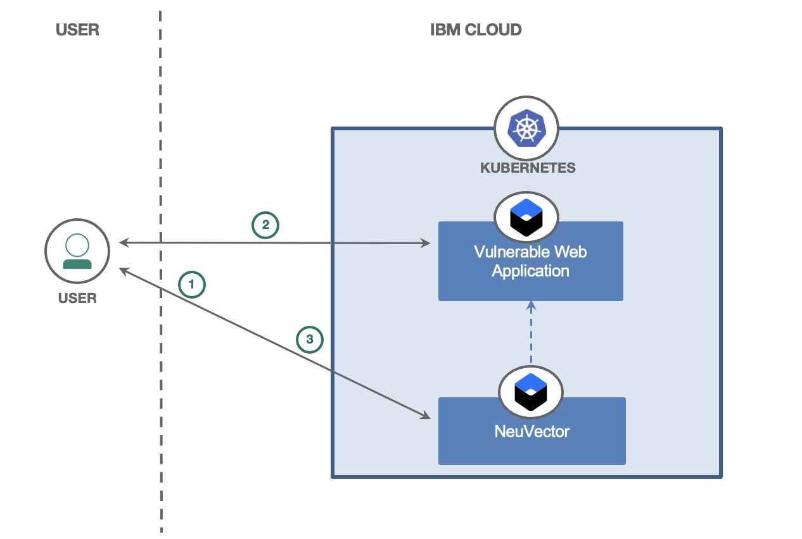
 
## Pre-requisites

* IBM Cloud Account - If you are using NeuVector Service available on IBM Cloud
* IBM Kubernetes Cluster or OpenShift Cluster
* kubectl CLI
* oc CLI
* helm 3 CLI

## Steps

1. Deploy NeuVector on your Cluster
2. Deploy Sample Application
3. Configure NeuVector
4. Set Policies To Detect Attacks
5. Trigger Security Events

### 1. Deploy NeuVector on your Cluster

Create an instance of NeuVector Container Security Platform.
Create an instance of IKS
Gain the access of cluster
After creating the instance of the service, click on the instance on dashboard. It will take you the page which provides you a set of instructions to deploy NeuVector on your IKS cluster.
Perform those steps
After successful deployment, it will give you URL to access NeuVector WebUI.

### 2. Deploy Sample Application

For this code pattern, we have chosen the popular and open-sourced sample application `DVWA (Damn Vulnerable Web Application)` as the target for the attacks. The deploy configuration is provided in this repository to deploy the application into Kubernetes cluster. Run the below command:

```
kubectl apply -f deployment.yaml
```

Access the application at `http://<public-ip-of-cluster>:32425/`. It will show the following page when you login first time:

<landing-page>

 Click on `Create/Reset Database`. It will configure database with some tables for the application. On re-logging, you will get following screen:
 
 <landing page 2>
 

### 3. Configure NeuVector

Access NeuVector using its webui link. Use `admin/admin` for the first time login.

* Accept the End User license agreement. Click on `Accept`.
* You will see the following in bottom-right corner.

<snapshot>
  
* Click on it to change the password. It will take you to the Profile Settings. Click on `Edit Profile`. Provide the current password and new password then `Save`.
* Login again with new password.
* Add license Key.
  
    Copy the license key from IBM Cloud Dashboard page.
  
    Go to Settings > License
  
    Paste the license key in License Code box. Click Activate.

Now you are all set to use NeuVector with your IKS Cluster. You can start with setting your own security policies and test.

### 4. Set Policies To Detect Attacks
  
  Let us now set up some policies to detect the various types of attack. 
  
  **(i) Cross site request forgery**
  
  The vulnerable application exposes an API for password change:
  /vulnerabilities/csrf/?password_new=password&password_conf=password&Change=Change
  
  Let us set up a policy that detects an invocation to this API.
  
  Click on `Policy` -> `DLP Sensors` on NeuVector Dashboard.
  
  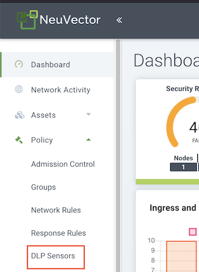
  
  Click on `Add`.
  
  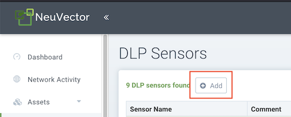
  
  * Enter a name for the sensor -`sensor.cross.site.request.forgery`.
  * Enter a name for the regex pattern for detection - `CSRF.password.change.requested`.
  * Enter the regex pattern that can detect the attack - `password*`.
  
   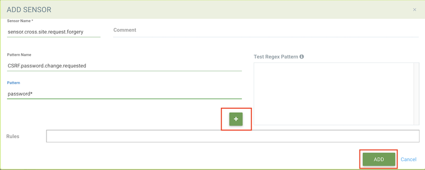
  
  Click on `+` and then click `Add`. Similarly we will add other sensors.
  
  
  
  **(ii) Malicious File Upload**
  
  It is possible to execute shell commands within PHP files. The below policy will detect `shell_exec` commands inside PHP files being uploaded.
  
  Add a sensor for detecting malicious file uploads:
  * Sensor name - sensor.malicious.phpfile.upload
  * Pattern name - malicious.file.shell.exec.command
  * Regex pattern - php.*shell_exec
  
  **(iii) Cross Site Scripting (XSS)**
  
  There are vulnerable APIs using which malicious scripts can be embedded in data sent to the application. The scripts can be embedded in query parameters of a GET request or inside form data of a POST request. The below policies will detect scripts being sent to the application inside a GET or a POST request.
  
  Add a sensor for detecting scripts in a GET request:
  * Sensor name - sensor.xss.get
  * Pattern name - XSS.script.in.request
  * Regex pattern - GET.*%3Cscript%3E.*HTTP/1
  
  Add a sensor for detecting scripts in a POST request:
  * Sensor name - sensor.xss.post
  * Pattern name - XSS.post.request
  * Regex pattern - POST.\*%3Cscript%3E.\*
  
  **(iv) Sensitive Data Exposure**
  
  The DLP sensor `sensor.creditcard` exists by default. This will be used to detect `credit card` information in requests.
  
  **(v) Command Injection**
  
  The vulnerable web application exposes an API using which you can ping an IP address or URL. It is possible to inject other commands with the IP Address or URL and get the results back. Here, you will set up a policy to detect the `ls` command being injected.
  
  Add a sensor for detecting command injections:
  * Sensor name - sensor.command.injection
  * Pattern name - command.injection.ls.command
  * Regex pattern - POST.\*%3Bls.\*
  
  **(vi) SQL Injection**
  
  This policy will detect `SELECT` queries injected into requests.
  
  Add a sensor for detecting SQL injections:
  * Sensor name - sensor.sql.injection
  * Pattern name - sql.injection.select.statement
  * Regex pattern - select.\*from.\*
  
  **(vii) API Service Protection**
  
  The vulnerable application exposes an API that gives access to uploaded files. This policy will detect any invocation to the API.
  
  Add a sensor for detecting forbidden api access:
  * Sensor name - sensor.forbidden.api
  * Pattern name - forbidden.uploads.folder.accessed
  * Regex pattern - GET.*/hackable/uploads.*HTTP
   
  
  **(viii) Container shell access**
  
### 5. Trigger Security Events and Analyze the Alerts

  #### 5.1 Cross site request forgery (CSRF)
  
  The vulnerable application exposes an API for password change:
  /vulnerabilities/csrf/?password_new=password&password_conf=password&Change=Change
  
  A script to invoke this GET request can be embedded in other web site pages. This will change the user's password and gives the hacker control to login to the   website.
  
  On the `DWVA` application Dashboard, click on `CSRF` on the menu bar.
  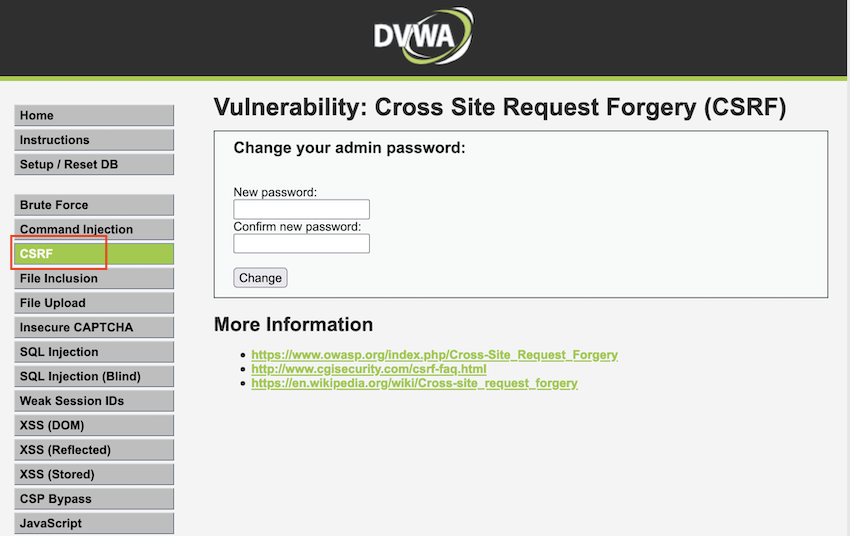
  
   Enter a new password with confirmation and click `Change`. This will send a request to the server to change the password.
  
  On the NeuVector Dashboard, select `Notifications` and click on `Security Events`. The below violation can be seen:
  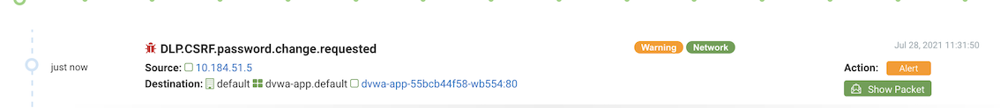
 
  #### 5.2 Malicious file upload
  
  Create a file `test.php` with the contents shown below.
  ```
  <?php echo shell_exec("ls");?>
  ```
  
  On the `DWVA` application Dashboard, click on `File Upload` on the menu bar. Click on `Browse`. Select the `test.php` file created earlier and click `Upload`.
  
  
  
  On the NeuVector Dashboard, select `Notifications` and click on `Security Events`. The below violation can be seen:
   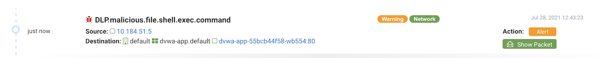
  
  #### 5.3 Reflected cross site scripting
  
  The vulnerable application exposes an API that enables an attackers script to run in an users browser:
  /vulnerabilities/xss_r/?name=
  
  Go to the `DVWA` application dashboard. Click on the `XSS (Reflected)` on the menu. Enter the text with a script tag in the `What's your name?` field - `<script>alert(xss)</script>`. Click `Submit`.
  A Javascript alert message `xss` will be displayed.
  
  On the NeuVector Dashboard, select `Notifications` and click on `Security Events`. The below violation can be seen:
   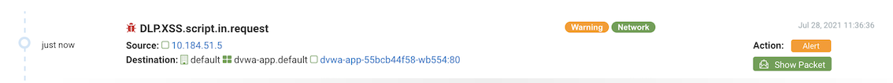
  
  #### 5.4 Stored cross site scripting
 
  The vulnerable application exposes a form at the url - /vulnerabilities/xss_s/. It is possible to embed a javascript code in the form and submit. This script will be executed for all other users upon loading this page.
  
  Go to the `DVWA` application dashboard. Click on `XSS (Stored)` on the menu. Enter a name in the `Name` field. In the `Message` field, enter `<script>alert('bad script')</script>`. Click `Sign Guestbook`. The message gets added on the page, and the script runs to display a javascript alert - `bad script`.
  
   On the NeuVector Dashboard, select `Notifications` and click on `Security Events`. The below violation can be seen:
   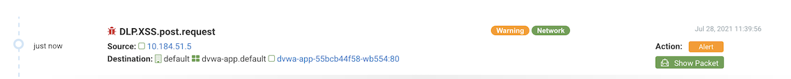
  
  #### 5.5 Sensitive data exposure
  
  In the `DVWA` application, the data is not encrypted. Any sensitive information like credit card number or social security number is vulnerable to theft.
  
  Let us use the `XSS (Stored)` option in the application and embed a credit card number in the message. Go to the `DVWA` application dashboard. Click on `XSS (Stored)` on the menu. Enter a name in the `Name` field. In the `Message` field, enter `4563876598762345`. Click `Sign Guestbook`.
  
   On the NeuVector Dashboard, select `Notifications` and click on `Security Events`. The below violation can be seen:
   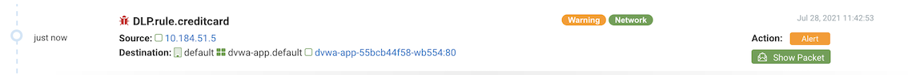

   #### 5.6 Command injection
  
  Go to the `DVWA` application dashboard. Click on `Command Injection` on the menu. In the `Enter an IP address` field, enter `example.com;ls`. Click `Submit`.
  You can see a response from the application with a list of files in the application directory.
  
  ```
PING example.com (93.xxx.xxx.34): 56 data bytes
64 bytes from 93.xxx.xxx.34: icmp_seq=0 ttl=56 time=1.456 ms
64 bytes from 93.xxx.xxx.34: icmp_seq=1 ttl=56 time=1.312 ms
64 bytes from 93.xxx.xxx.34: icmp_seq=2 ttl=56 time=1.273 ms
64 bytes from 93.xxx.xxx.34: icmp_seq=3 ttl=56 time=1.340 ms
--- example.com ping statistics ---
4 packets transmitted, 4 packets received, 0% packet loss
round-trip min/avg/max/stddev = 1.273/1.345/1.456/0.068 ms
help
index.php
source
  ```
  On the NeuVector Dashboard, select `Notifications` and click on `Security Events`. A violation can be seen for the command injection policy.  In addition, you can see violations for running the `ping` and `ls` command on the container shell.
  
   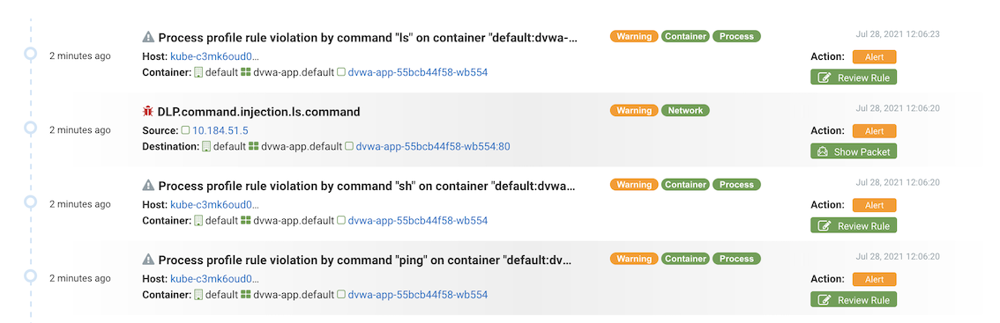
  
  #### 5.7 SQL injection
  
  Go to the `DVWA` application dashboard. Click on `SQL Injection` on the menu. In the `User ID` field enter the SQL - `SELECT * FROM USERS`.
  On the NeuVector Dashboard, select `Notifications` and click on `Security Events`. A violation can be seen for the command injection policy.
  
   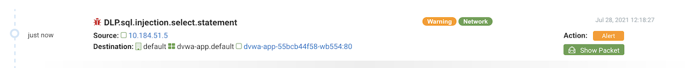
  
  #### 5.8 API Service Protection
  
  Let us invoke the `test.php` that you uploaded earlier.
  Invoke the url on the browser - [Base URL of the DWVA application]/hackable/uploads/test.php
  
  The below response can be seen on the browser when the access is not prevented:
  ```
  dvwa_email.png hack1.php hack2.php test.php 
  ```
  
   On the NeuVector Dashboard, select `Notifications` and click on `Security Events`. The below violation can be seen.
  
  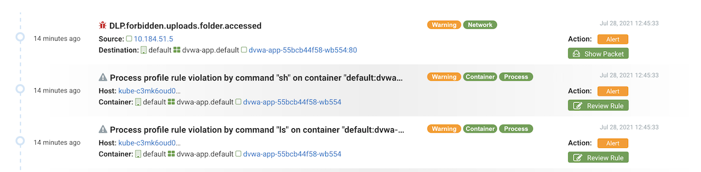
  
  ### 6. Summary
  
  
## License

This code pattern is licensed under the Apache License, Version 2. Separate third-party code objects invoked within this code pattern are licensed by their respective providers pursuant to their own separate licenses. Contributions are subject to the [Developer Certificate of Origin, Version 1.1](https://developercertificate.org/) and the [Apache License, Version 2](https://www.apache.org/licenses/LICENSE-2.0.txt).

[Apache License FAQ](https://www.apache.org/foundation/license-faq.html#WhatDoesItMEAN)
