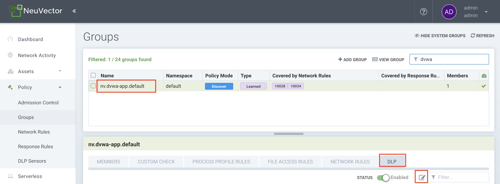
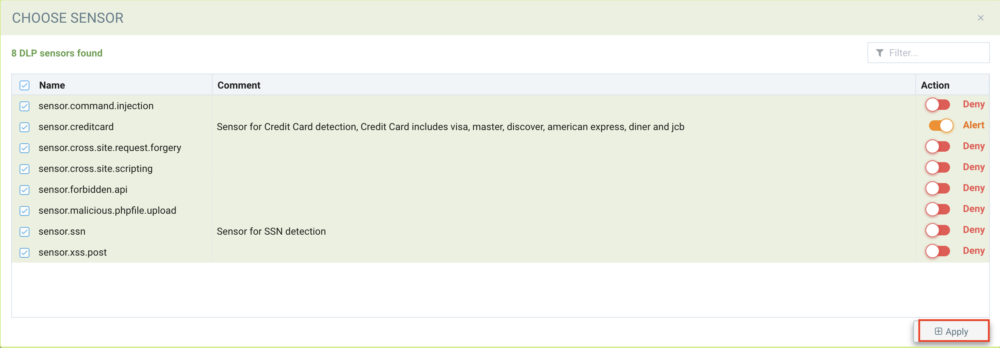

# Protect your web application using advanced runtime container security

> Learn to implement Container firewall and Web-application firewall using NeuVector

## Introduction

Web application security is a mandatory requirement for any web application accessible on the internet. There are many types of attacks on web applications that can result in loss of sensitive and confidential information, frauds and denial of service. The Open Web Application Security Project (OWASP) which is a nonprofit foundation have published the [top ten attacks](https://owasp.org/www-project-top-ten/) on web applications. The web application security must take care to prevent such attacks.

In the cloud native era, the applications are deployed in a container environments based on Kubernetes. The container security is equally critical in addition to web application security. The container runtime security can monitor all activities within a container to detect threats.

[NeuVector](https://neuvector.com/) is cloud-native container firewall for monitoring and protecting Kubernetes container deployments in production. It allows you to inspect container network traffic, learn how an application communicates with other applications and, protect and monitor against security attacks. It provides enterprise-grade security.

In this code pattern, you will see how to use NeuVector to prevent web application and container runtime threats.
Once you complete the code pattern, you will learn how to:
- Deploy NeuVector on IBM Kubernetes/OpenShift cluster.
- Configure security policies in NeuVector to detect and prevent the following types of attack - Cross Site Request Forgery (CSRF), Malicious File Upload, Cross Site Scripting (XSS), Sensitive Data Exposure, Command Injection, SQL Injection, API Service Protection and Container shell access.
- Test the application for attacks and analyze alerts from NeuVector.

## Flow

 
 
 1. User (developer) configures security policies in NeuVector.
 2. User (developer/hacker) accesses the web application and trigger some security attacks.
 3. User (admin/developer) gets notification of the security attacks and its details on NeuVector Dashboard.

 
## Pre-requisites

* [IBM Cloud Account](https://cloud.ibm.com/registration) - If you are using NeuVector Service available on IBM Cloud.
* [IBM Kubernetes Cluster](https://cloud.ibm.com/kubernetes/catalog/create) and `kubectl` CLI - If you plan to deploy your application and NeuVector on Kubernetes.
* [OpenShift Cluster](https://cloud.ibm.com/kubernetes/catalog/create?platformType=openshift) and `oc` CLI - If you plan to deploy your application and NeuVector on OpenShift.
* [Helm 3](https://helm.sh/docs/intro/install/) CLI

## Steps

1. [Deploy NeuVector on your Cluster](#1-deploy-neuvector-on-your-cluster)
2. [Deploy Sample Application](#2-deploy-sample-application)
3. [Explore NeuVector](#3-explore-neuvector)
4. [Set policies to detect attacks](#4-set-policies-to-detect-attacks)
5. [Trigger Security Events and Analyze the Alerts](#5-trigger-security-events-and-analyze-the-alerts)
6. [Summary](#6-summary)


### 1. Deploy NeuVector on your Cluster

Create an instance of NeuVector Container Security Platform.

If you are using IBM Kubernetes Cluster(IKS), then you can follow the instructions provided [here](https://github.com/IBM/protect-webapp-using-runtime-container-security/blob/main/deploy-neuvector-using-ibmcloud-svc.md).

If you plan to use OpenShift, then you will be deploying NeuVector using operator. Instructions are given [here](https://catalog.redhat.com/software/operators/detail/5ec3fa84ef29fd35586d9a16).

For this code pattern, we have used IBM Kubernetes Cluster and have deployed NeuVector on IKS using the [NeuVector service on IBM Cloud](https://cloud.ibm.com/catalog/services/neuvector-container-security-platform).

### 2. Deploy Sample Application

For this code pattern, we have chosen the popular and open-sourced sample application `DVWA (Damn Vulnerable Web Application)` as the target for the attacks. The configuration to deploy the application into Kubernetes cluster is provided in this repository as `deployment.yaml`. Run the below command to deploy the application:

```
kubectl apply -f deployment.yaml
```

> Note: The provided deploy configuration uses 32425 port for service. If this port is not available or you want to use different port, please modify it in the  deployment.yaml and then run.

Access the application at `http://<public-ip-of-cluster>:32425/`. 

Login to the application with default credentials `admin/password`. After login to the application first-time, you will get the following screen:

  

Click on `Create/Reset Database`. It will configure the required database with its tables for the application. On re-logging, you will get following screen:
 
  
   
Now the application is up and running, let's understand NeuVector and set some security policies as explained further.

### 3. Explore NeuVector

Access NeuVector using its webui link. 
> Please ensure that you have activated NeuVector by providing proper License code before proceeding further.

Use `admin/admin` for the first time login or login with the new password if it is changed already. It takes you to the NeuVector dashboard as shown below. It shows different types of charts based on security events, risk, vulnerable pods and so on. But the most of the charts may not have any data if you are accessing first time.


Go to Network Activity in left panel, it will show the pods running in your cluster as shown below. Notice that it also shows the `dvwa-app-**` pod which is the pod of your sample application deployed in previous step.


You can explore more on other functionalities. Some of those used in this code pattern are:

* **Assets > Containers** that shows more details including its vulnerabilities, stats, state (discover/monitor/protect), scan status and many more.
* **Assets > System Components** that shows system components which include controlller pods, scanner pods and enforcer.
* **Policy > Groups** that provides you the ability to filter group, for example if you filter for your sample application using `dvwa` then on selecting this group, it allows you to add more rules(process profile/file access/network), DLP, switch mode(say Monitor to Protect), export group policy and so on.
* **Policy > DLP Sensors** that allows you to add more DLP sensors as explained in next step. After defining the DLP sensors, it can be applied to any group.
* **Notification > Security Events** is the place where you will be getting all type of security alerts based on the applied rules and DLP sensors. Security events can also be filtered based on groups/type of rules and so on.

You can refer to the [webinar](https://vimeo.com/526381155) which is a comprehensive guide of NeuVector. After exploring such functionalities, you are all set to use NeuVector with your application. Follow the next steps to set your own security policies and test.

### 4. Set Policies To Detect Attacks
  
  Let us now set up some policies to detect the various types of attack.
  
  > NOTE: These DLP rules are created for demo purposes. They should be fine-tuned to reduce false positives and false negatives when used in the real environment.
  
   ***(i) Cross site request forgery***

   The vulnerable application exposes an API for password change:
   http://[public-ip-of-cluster]:32425/vulnerabilities/csrf/?password_new=password&password_conf=password&Change=Change

   Let us set up a policy that detects an invocation to this API.

   Click on `Policy` -> `DLP Sensors` on NeuVector Dashboard.

   

   Click on `Add`.

   
       

   * Enter a name for the sensor -`sensor.cross.site.request.forgery`.
   * Enter a name for the regex pattern for detection - `CSRF.password.change.requested`.
   * Enter the regex pattern that can detect the attack - `password_new=.*&password_conf=.*`.

    > Note: The name of the sensor and the pattern can be any name of your choice.
    
    
   


   Click on `+` and then click `Add`. Similarly we will add other sensors.
  
  
   ***(ii) Malicious File Upload***

   The sample application provides the functionality to upload the file. There is a possibility that an user tries to execute commands in the container shell to get some confidential information using that file. To avoid that you can set a security policy which will scan the file to be uploaded and take action accordingly. For example, if an user tries to upload a php file which has instruction to run shell commands then the below policy will detect `shell_exec` commands inside PHP files being uploaded.

   Add a sensor for detecting malicious file uploads:
   * Sensor name - sensor.malicious.phpfile.upload
   * Pattern name - malicious.file.shell.exec.command
   * Regex pattern - php.*shell_exec
  
   ***(iii) Cross Site Scripting (XSS)***

   There are vulnerable APIs using which malicious scripts can be embedded in data sent to the application. The scripts can be embedded in query parameters of a GET request or inside form data of a POST request. The below policies will detect scripts being sent to the application inside a GET or a POST request.

   Add a sensor for detecting scripts in a GET request:
   * Sensor name - sensor.xss.get
   * Pattern name - XSS.script.in.request
   * Regex pattern - GET.*%3Cscript%3E.*HTTP/1

   Add a sensor for detecting scripts in a POST request:
   * Sensor name - sensor.xss.post
   * Pattern name - XSS.post.request
   * Regex pattern - POST.\*%3Cscript%3E.\*

   ***(iv) Sensitive Data Exposure***

   The DLP sensor `sensor.creditcard` exists by default. This will be used to detect `credit card` information in requests.

   ***(v) Command Injection***

   The vulnerable web application exposes an API using which you can ping an IP address or URL. It is possible to inject other commands with the IP Address or URL and get the results back. Here, you will set up a policy to detect the `ls` command being injected.

   Add a sensor for detecting command injections:
   * Sensor name - sensor.command.injection
   * Pattern name - command.injection.ls.command
   * Regex pattern - POST.\*%3Bls.\*

   ***(vi) SQL Injection***

   If an user tries to embed a SQL query through any of the input parameters, this policy will detect `SELECT` queries injected into requests.

   Add a sensor for detecting SQL injections:
   * Sensor name - sensor.sql.injection
   * Pattern name - sql.injection.select.statement
   * Regex pattern - select.\*from.\*

   ***(vii) API Service Protection***

   The vulnerable application exposes an API that gives access to the uploaded files. An user may try to download or execute the file to get some important information. This policy will detect any invocation to the API.

   Add a sensor for detecting forbidden api access:
   * Sensor name - sensor.forbidden.api
   * Pattern name - forbidden.uploads.folder.accessed
   * Regex pattern - GET.*/hackable/uploads.*HTTP
   
 Till now, you have defined the required DLP sensors. To see them in-action, you need to apply these sensors to the DVWA-service.
 
**Add DLP sensors to the application group**
  
  Let us add the sensors to monitor the web application for attacks. Select `Policy` on the left menu and select `Groups`. Filter for the DWVA application as shown below. Select the `DLP` tab and click on the `Edit` icon. 
  
  
  
  
  The sensors that you created earlier are listed. Select all the sensor and click `Apply`.
  
   
  
  
**Container shell access or Process Profile Rules**
  
  Initially NeuVector learned on its own about the required processes required for the application to run. So you will find some process profile rules defined by default with action as `Allow`. And you are allowed to change the action to be taken for those.
  
  So if an user tries to access container shell directly or somehow get the access, then `Process Profile Rules` detects those. But if there is a specific requirement, say do not allow access of `/bin/sh`, then new rules can be added directly for the group using `Policy > Groups` as shown below.
  
  
  

**Change Policy Mode for the Application**

   At this moment, `Policy Mode` is set to `Discover`. As all the policies have been set now, then we can change the policy mode and test the system.
   
   Select `Policy` on the left menu and select `Groups`. Select the group for the DWVA application as shown below. Click on `Switch Mode` and select `Monitor`. The `Monitor` mode will generate warning alerts for all the attacks.
  
  
  
  If you change to `Protect`, then if any request which triggers the security event is detected, it will be blocked and the event will be recorded with Deny action.
  
  
### 5. Trigger Security Events and Analyze the Alerts

  ***(i) Cross site request forgery (CSRF)***
  
  The vulnerable application exposes an API for password change:
  http://[public-ip-of-cluster]:32425//vulnerabilities/csrf/?password_new=password&password_conf=password&Change=Change
  
  A script to invoke this GET request can be embedded in other web site pages. This will change the user's password and gives the hacker control to login to the   website.
  
  On the `DWVA` application Dashboard, click on `CSRF` on the menu bar.
  
  
  
   Enter a new password with confirmation and click `Change`. This will send a request to the server to change the password.
  
  On the NeuVector Dashboard, select `Notifications` and click on `Security Events`. The below violation can be seen:
  
 
  ***(ii) Malicious file upload***
  
  Create a file `test.php` with the contents shown below.
  ```
  <?php echo shell_exec("ls");?>
  ```
  
  On the `DWVA` application Dashboard, click on `File Upload` on the menu bar. Click on `Browse`. Select the `test.php` file created earlier and click `Upload`.
  
  On the NeuVector Dashboard, select `Notifications` and click on `Security Events`. The below violation can be seen:
   
  
  ***(iii) Reflected cross site scripting***
  
  The vulnerable application exposes an API that enables an attackers script to run in an users browser:
    http://[public-ip-of-cluster]:32425/vulnerabilities/xss_r/?name=[user entered data]
  
  Go to the `DVWA` application dashboard. Click on the `XSS (Reflected)` on the menu. Enter the text with a script tag in the `What's your name?` field - `<script>alert(xss)</script>`. Click `Submit`.
  A Javascript alert message `xss` will be displayed.
  
  On the NeuVector Dashboard, select `Notifications` and click on `Security Events`. The below violation can be seen:
   
  
  ***(iv) Stored cross site scripting***
 
  The vulnerable application exposes a form at the url -   http://[public-ip-of-cluster]:32425/vulnerabilities/xss_s/. It is possible to embed a javascript code in the form and submit. This script will be executed for all other users upon loading this page.
  
  Go to the `DVWA` application dashboard. Click on `XSS (Stored)` on the menu. Enter a name in the `Name` field. In the `Message` field, enter `<script>alert('bad script')</script>`. Click `Sign Guestbook`. The message gets added on the page, and the script runs to display a javascript alert - `bad script`.
  
   On the NeuVector Dashboard, select `Notifications` and click on `Security Events`. The below violation can be seen:
   
  
  ***(v) Sensitive data exposure***
  
  In the `DVWA` application, the data is not encrypted. Any sensitive information like credit card number or social security number is vulnerable to theft.
  
  Let us use the `XSS (Stored)` option in the application and embed a credit card number in the message. Go to the `DVWA` application dashboard. Click on `XSS (Stored)` on the menu. Enter a name in the `Name` field. In the `Message` field, enter `4563876598762345`. Click `Sign Guestbook`.
  
   On the NeuVector Dashboard, select `Notifications` and click on `Security Events`. The below violation can be seen:
   

   ***(vi) Command injection***
  
  Go to the `DVWA` application dashboard. Click on `Command Injection` on the menu. In the `Enter an IP address` field, enter `example.com;ls`. Click `Submit`.
  You can see a response from the application with a list of files in the application directory.
  
  ```
PING example.com (93.xxx.xxx.34): 56 data bytes
64 bytes from 93.xxx.xxx.34: icmp_seq=0 ttl=56 time=1.456 ms
64 bytes from 93.xxx.xxx.34: icmp_seq=1 ttl=56 time=1.312 ms
64 bytes from 93.xxx.xxx.34: icmp_seq=2 ttl=56 time=1.273 ms
64 bytes from 93.xxx.xxx.34: icmp_seq=3 ttl=56 time=1.340 ms
--- example.com ping statistics ---
4 packets transmitted, 4 packets received, 0% packet loss
round-trip min/avg/max/stddev = 1.273/1.345/1.456/0.068 ms
help
index.php
source
  ```
  On the NeuVector Dashboard, select `Notifications` and click on `Security Events`. A violation can be seen for the command injection policy.  In addition, you can see violations for running the `ping` and `ls` command on the container shell.
  
   
  
  ***(vii) SQL injection***
  
  Go to the `DVWA` application dashboard. Click on `SQL Injection` on the menu. In the `User ID` field enter the SQL - `SELECT * FROM USERS`.
 
  On the NeuVector Dashboard, select `Notifications` and click on `Security Events`. A violation can be seen for the SQL injection policy.
  
   
  
  ***(viii) API Service Protection***
  
  Let us invoke the `test.php` that you uploaded earlier.
  
  Invoke the url on the browser -   http://[public-ip-of-cluster]:32425/hackable/uploads/test.php
  
  The below response can be seen on the browser when the access is not prevented:
  ```
  dvwa_email.png test.php 
  ```
  
   On the NeuVector Dashboard, select `Notifications` and click on `Security Events`. The below violation can be seen.
  
  
  
  ***(ix) Container shell access***
  
  The container shell was accessed during `Command Injection`, and also when `test.php` was invoked to check `API Service Protection`. NeuVector triggered alerts when any command is run on the container shell as shown in the above snapshot.
  
  
**Change Policy Mode to Protect**
  
  Let us now change the policy mode to deny access and prevent the attack. Select `Policy` on the left menu and select `Groups`. Select the group for the DWVA application as shown below. Click on `Switch Mode` and select `Protect`. 
  
  Now you can test any of the attack. Let us try `API Service Protection`.
  
  Invoke the url on the browser again -   http://[public-ip-of-cluster]:32425/hackable/uploads/test.php
  
  This time this API canot be accessed and you can see the below alert on the `Security Events` page.
  
   
  
  ### 6. Summary
  
  In this code pattern, you saw how to set up security policies in `NeuVector` using DLP sensors. The sensors could detect various types of web application attacks like CSRF, XSS, Command Injection, SQL Injection, Forbidden API access, Sensitive Data Exposure and Container shell access. The security policies are confidential to the organization and depend on the web application being protected. The exhaustive list of policies to protect a web application must be developed in collaboration with the security team in the organization. Once the vulnerabilities are detected, the application must be enhanced and made secure against those type of attacks. 
  
## License

This code pattern is licensed under the Apache License, Version 2. Separate third-party code objects invoked within this code pattern are licensed by their respective providers pursuant to their own separate licenses. Contributions are subject to the [Developer Certificate of Origin, Version 1.1](https://developercertificate.org/) and the [Apache License, Version 2](https://www.apache.org/licenses/LICENSE-2.0.txt).

[Apache License FAQ](https://www.apache.org/foundation/license-faq.html#WhatDoesItMEAN)
