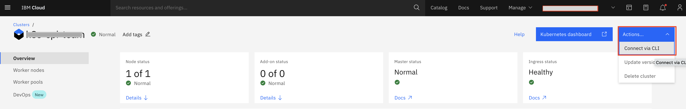
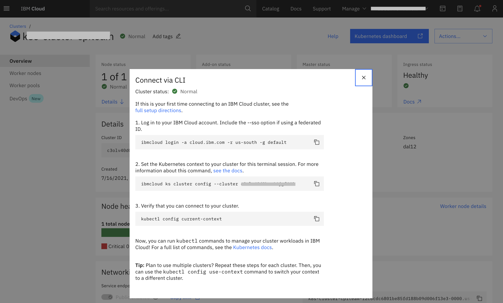
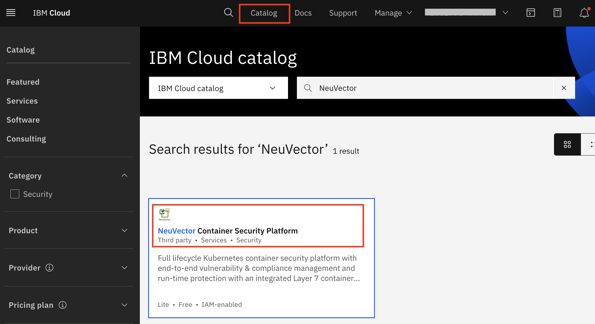
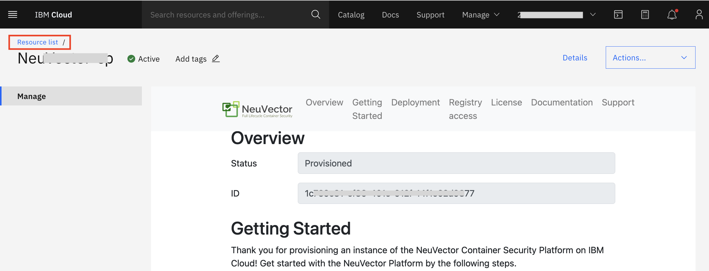
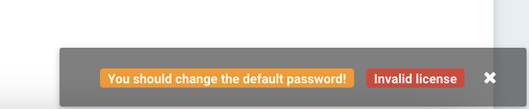
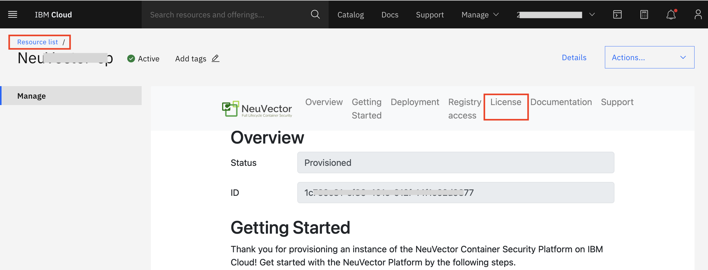

# Deploy NeuVector Service on Kubernetes from IBM Cloud Catalog

## Introduction

Containers technology makes it easy to deploy applications in the cloud and Kubernetes is one of the popular choices for deploying containerized applications. But in this new and ever-changing container and microservices world, container security is critical. Vulnerabilities in applications residing within a container can be exploited if the right protections are not in place. This tutorial demonstrates how NeuVector integrates with the IBM Cloud Kubernetes Service to provide complete runtime container security for your production Kubernetes workloads.

NeuVector is a cloud-native container firewall for monitoring and protecting Kubernetes container deployments in production. The NeuVector solution is comprised of security containers, which can be deployed on each node similar to how you deploy your applications using Kubernetes. For evaluation purposes, NeuVector makes an Allinone container and an Enforcer container available. 

<!-- 
These can be pulled from Docker Hub , along with documentation, by requesting access from info@neuvector.com
-->

## Pre-requisites

* [IBM Cloud account](https://cloud.ibm.com/registration). Note: To create a Kubernetes cluster to complete this tutorial, you must have a Pay-As-You-Go or Subscription account.
* [IBM Cloud Command Line Interface](https://cloud.ibm.com/docs/cli/) (CLI) tool.
* [IBM Cloud Kubernetes Service](https://cloud.ibm.com/docs/cli?topic=cli-install-devtools-manually#idt-install-kubernetes-cli-plugin) plug-in.
* [Helm 3](https://helm.sh/docs/intro/install/) CLI
* [Kubernetes CLI](https://kubernetes.io/docs/tasks/tools/) (kubectl)
    
<!-- 
Docker account.
    Free trial license for NeuVector full lifecycle container security console from the Red Hat Marketplace.

In addition, you must contact support@neuvector.com to request that your Docker Hub ID be added to the NeuVector private registry.

-->     
   
## Steps 

### Step 1. Create a Kubernetes Cluster in IBM Cloud

1. Log into your IBM Cloud account. Select `Kubernetes` from the Navigation Menu.

2. On the [Kubernetes Overview](https://cloud.ibm.com/kubernetes/overview) page, select `Create a Cluster`.

3. To create a cluster, set the following parameters:

    * Select `Standard` from the list of pricing plans.
    * Within the `Orchestration services` section, select the most current version of Kubernetes (if you are presented with a choice).
    * If you are offered `Infrastructure` options, choose Classic.
    * If you are offered `Location` choices, keep the default options that are prefilled.
    * If you are offered `Worker pool` choices to set up the number of worker nodes for your workload, leave it at the default number. (This can be resized.)
    * Within the `Resource details` section, enter a name for your cluster.
    * In the `Summary` pane, review the order summary and then click Create.

    Worker nodes can take a few minutes to provision, but you can see the progress in the Worker nodes tab. When the status reaches Ready, you can start working with your cluster. See the [Getting started with IBM Cloud Kubernetes Service](https://cloud.ibm.com/docs/containers/cs_planning.html) documentation for more details about cluster creation.


<!--  Select Free from the list of pricing plans -> Select `Standard` from the list of pricing plans. -->

You can also create a cluster from the command line by using the following IBM Cloud CLI command:

```
ibmcloud ks cluster create classic --name my_cluster
```

### Step 2. Access the Kubernetes Cluster

Now that the cluster is provisioned, you can access it from the IBM Cloud CLI tool that you downloaded in the Prerequisites.

Go to IBM Cloud Dashboard, click on Clusters under Resource Summary section, then click on the name of the cluster that you created in step 1. Then click on `Actions > Connect via CLI` as shown.



It will lists the instructions to be performed as shown:



Follow the instructions on the terminal to:

* Log into your cluster.
* Set the Kubernetes context to your cluster.
* Verify that you can connect to your cluster.

### Step 3. Deploy NeuVector onto your Kubernetes cluster

#### 3.1 Create NeuVector Service Instance using IBM Cloud

Create an instance of NeuVector Container Security Platform using IBM Cloud Catalog. 



Provide the name of the service of your choice and click on create.

Once the service is created, go to `IBM Cloud Dashboard > Resource Summary section > Services and Softwares` and click on the name of the NeuVector service created. It will take you the page to manage the NeuVector service instance. 



Go to the `Deployment` section. The steps mentioned under `Deploying the NeuVector Platform on an IBM Cloud IKS cluster` needs to be executed. It asks you to download two configuration files inclusing secret manifest and helm values. Please download those in the current working directory and copy the below steps in one bash script and execute all the steps in one go using the script.

> Note: Please replace the `IC_IKS_CLUSTER_ID` value in below script with your cluster ID. To get your cluster ID, you can use the command `ibmcloud ks cluster ls |grep <cluster-name>`.

```
# To get your cluster ID
#ibmcloud ks cluster ls |grep <cluster-name>

# Set IKS cluster id (e.g. c1cd1i4xxxj1v6g)
IC_IKS_CLUSTER_ID=c1cd1i4xxxj1v6g

ibmcloud ks cluster config --admin --cluster $IC_IKS_CLUSTER_ID

IC_IKS_INGRESS_DOMAIN=$(ibmcloud ks cluster get --cluster $IC_IKS_CLUSTER_ID --json | python -c "import json,sys;obj=json.load(sys.stdin);print((obj['ingress']['hostname'] if 'ingress' in obj and 'hostname' in obj['ingress'] else (obj['ingressHostname'] if 'ingressHostname' in obj else '')));")
echo $IC_IKS_INGRESS_DOMAIN

IC_IKS_INGRESS_SECRET_NAME=$(ibmcloud ks cluster get --cluster $IC_IKS_CLUSTER_ID --json | python -c "import json,sys;obj=json.load(sys.stdin);print((obj['ingress']['secretName'] if 'ingress' in obj and 'secretName' in obj['ingress'] else (obj['ingressSecretName'] if 'ingressSecretName' in obj else '')));")
echo $IC_IKS_INGRESS_SECRET_NAME

kubectl config current-context
kubectl get pod --all-namespaces

kubectl create namespace neuvector

kubectl apply -n neuvector -f ./neuvector-secret-registry.yaml

NV_VERSION=4.2.2

helm install \
    'neuvector-core' \
    'core' \
    --repo 'https://neuvector.github.io/neuvector-helm/' \
    --namespace neuvector \
    --values ./neuvector-helm.yaml \
    --set "manager.ingress.host=neuvector.${IC_IKS_INGRESS_DOMAIN}" \
    --set "manager.ingress.secretName=${IC_IKS_INGRESS_SECRET_NAME}" \
    --set "tag=${NV_VERSION}" \
    --atomic --wait
```

After successful execution of all steps, it will give you URL to access NeuVector WebUI as https://neuvector.${IC_IKS_INGRESS_DOMAIN}.

#### 3.2 Apply NeuVector License

Access the URL provided after successful deployment and login to NeuVector using default credentials `admin/admin`.

* Accept the End User license agreement. Click on `Accept`.
* You will see the following in bottom-right corner.

  
  
* You can click on it to change the password.  It will take you to the Profile Settings. Click on `Edit Profile`. Provide the current password and new password then `Save`.
* Login again with new password.
* Next is to add license key. Navigate to the `License` section as shown and copy the license key.

  
  
* Login to NeuVector and navigate to `Settings > License`. Paste the copied license key in License Code box and click Activate.

Now you are all set to use NeuVector with your IKS Cluster.

## Summary

The IBM Cloud Kubernetes Service makes it easy to set up a Kubernetes cluster to host your containerized applications. When running such applications in production, security is required to ensure that the applications are safe and communicating properly. NeuVector provides that runtime security in any cloud environment, providing a Layer 7 firewall, host and container processes monitoring, and vulnerability scanning solution. You can request a demo and access to the download by contacting NeuVector at info@neuvector.com.
